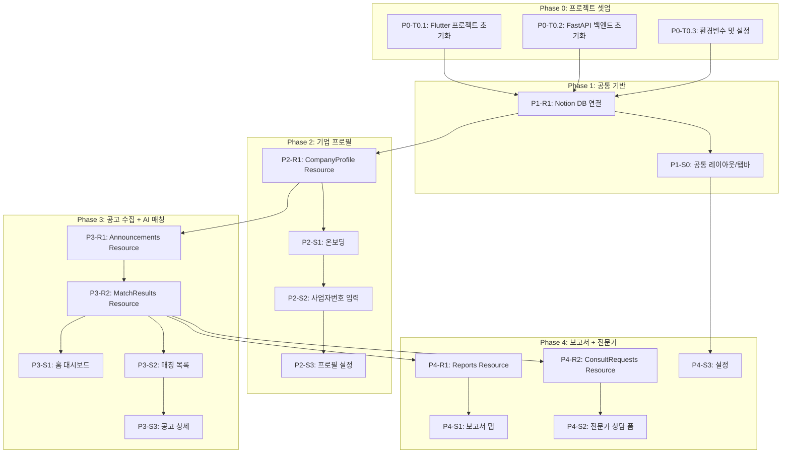

# TASKS.md - IRIS 정부지원사업 자동 매칭 앱

> **생성**: /tasks-generator (Domain-Guarded 모드)
> **기술 스택**: Flutter + FastAPI + Notion DB + OpenAI GPT
> **총 태스크**: 38개

---

## 의존성 그래프

---

## Phase 0: 프로젝트 셋업

### [x] P0-T0.1: Flutter 프로젝트 초기화
- **담당**: frontend-specialist
- **파일**: `pubspec.yaml`, `lib/main.dart`
- **스펙**: Flutter 프로젝트 생성, 의존성 설치 (dio, riverpod, go_router, pdf)
- **TDD**: N/A (셋업)

### [x] P0-T0.2: FastAPI 백엔드 초기화
- **담당**: backend-specialist
- **파일**: `backend/requirements.txt`, `backend/main.py`, `backend/app/config.py`
- **스펙**: FastAPI 프로젝트 구조 생성, 의존성 설치 (fastapi, uvicorn, httpx, beautifulsoup4, openai, notion-client)
- **TDD**: N/A (셋업)

### [x] P0-T0.3: 환경변수 및 설정
- **담당**: backend-specialist
- **파일**: `backend/.env.example`, `backend/app/config.py`
- **스펙**: OPENAI_API_KEY, NOTION_API_TOKEN, NOTION_DB_*_ID, SMTP 설정 템플릿
- **TDD**: N/A (셋업)

---

## Phase 1: 공통 기반

### P1-R1: Notion DB 연결 Resource

#### [ ] P1-R1-T1: Notion DB 클라이언트 구현
- **담당**: backend-specialist
- **리소스**: notion_db (공통)
- **엔드포인트**: N/A (내부 서비스)
- **필드**: Notion API CRUD wrapper
- **파일**: `backend/tests/test_notion_client.py` → `backend/app/services/notion_db.py`
- **스펙**: Notion API 연결, DB CRUD 래퍼, 에러 핸들링
- **Worktree**: `worktree/phase-1-common`
- **TDD**: RED → GREEN → REFACTOR

### P1-S0: 공통 레이아웃

#### [ ] P1-S0-T1: 하단 탭바 + 라우팅 구현
- **담당**: frontend-specialist
- **화면**: 전체 (공통)
- **컴포넌트**: BottomTabBar, AppRouter
- **파일**: `lib/app/app.dart`, `lib/app/routes.dart`, `lib/widgets/bottom_tab_bar.dart`
- **스펙**: 4탭(홈/매칭/보고서/설정) 하단 탭바, go_router 라우팅 설정
- **Worktree**: `worktree/phase-1-common`
- **TDD**: RED → GREEN → REFACTOR
- **데모**: 탭 전환 동작

#### [ ] P1-S0-T2: 디자인 시스템 토큰 적용
- **담당**: frontend-specialist
- **파일**: `lib/core/theme/app_theme.dart`, `lib/core/theme/colors.dart`, `lib/core/theme/typography.dart`
- **스펙**: 05-design-system.md 기반 컬러/타이포/간격 토큰 정의
- **Worktree**: `worktree/phase-1-common`
- **TDD**: RED → GREEN → REFACTOR

#### [ ] P1-S0-T3: 공통 위젯 구현
- **담당**: frontend-specialist
- **컴포넌트**: MatchScoreGauge, DdayBadge, MatchCard, EmptyState, LoadingIndicator, TagInput
- **파일**: `lib/widgets/` 폴더 내 각 위젯
- **스펙**: shared/components.yaml + shared/types.yaml 기반 공통 위젯
- **Worktree**: `worktree/phase-1-common`
- **TDD**: RED → GREEN → REFACTOR

---

## Phase 2: 기업 프로필

### P2-R1: CompanyProfile Resource

#### [ ] P2-R1-T1: 공공API 기업 조회 서비스 구현
- **담당**: backend-specialist
- **리소스**: company_profile
- **엔드포인트**:
  - POST /api/v1/company/lookup (사업자번호 → 기업정보 조회)
- **필드**: business_number, company_name, ceo_name, industry, revenue, employee_count, address
- **파일**: `backend/tests/test_company.py` → `backend/app/services/public_api.py`, `backend/app/routers/company.py`
- **스펙**: 공공API(기업마당) 연동, 사업자번호 유효성 검증, Notion DB 저장
- **Worktree**: `worktree/phase-2-profile`
- **TDD**: RED → GREEN → REFACTOR
- **병렬**: 단독 실행

#### [ ] P2-R1-T2: 기업 프로필 수정 API 구현
- **담당**: backend-specialist
- **리소스**: company_profile
- **엔드포인트**:
  - PUT /api/v1/company/profile (프로필 수정)
- **필드**: research_fields, tech_keywords (추가 입력)
- **파일**: `backend/tests/test_company_update.py` → `backend/app/routers/company.py`
- **스펙**: 연구분야/기술키워드 업데이트, Notion DB 수정
- **Worktree**: `worktree/phase-2-profile`
- **TDD**: RED → GREEN → REFACTOR
- **병렬**: P2-R1-T1 완료 후

### P2-S1: 온보딩 화면

#### [ ] P2-S1-T1: 온보딩 UI 구현
- **담당**: frontend-specialist
- **화면**: /onboarding
- **컴포넌트**: OnboardingPager, StartButton
- **데이터 요구**: 없음 (정적 화면)
- **파일**: `test/features/onboarding/onboarding_test.dart` → `lib/features/onboarding/onboarding_screen.dart`
- **스펙**: 3페이지 슬라이드, 페이지 인디케이터, 시작하기/건너뛰기 버튼
- **Worktree**: `worktree/phase-2-profile`
- **TDD**: RED → GREEN → REFACTOR
- **데모 상태**: normal

### P2-S2: 사업자번호 입력 화면

#### [ ] P2-S2-T1: 사업자번호 입력 UI 구현
- **담당**: frontend-specialist
- **화면**: /register
- **컴포넌트**: BusinessNumberInput, LookupButton
- **데이터 요구**: company_profile (data_requirements 참조)
- **파일**: `test/features/profile/register_test.dart` → `lib/features/profile/register_screen.dart`
- **스펙**: 10자리 숫자 입력, 자동 하이픈, 조회 버튼, 로딩/에러 상태 처리
- **Worktree**: `worktree/phase-2-profile`
- **TDD**: RED → GREEN → REFACTOR
- **데모 상태**: loading, error, normal

### P2-S3: 기업 프로필 설정 화면

#### [ ] P2-S3-T1: 프로필 설정 UI 구현
- **담당**: frontend-specialist
- **화면**: /profile/edit
- **컴포넌트**: AutoFilledSection, ResearchFieldsInput, TechKeywordsInput, SaveButton
- **데이터 요구**: company_profile (data_requirements 참조)
- **파일**: `test/features/profile/profile_edit_test.dart` → `lib/features/profile/profile_edit_screen.dart`
- **스펙**: API 데이터 자동채움, 연구분야 멀티셀렉트, 기술키워드 태그 입력, 저장
- **Worktree**: `worktree/phase-2-profile`
- **TDD**: RED → GREEN → REFACTOR
- **데모 상태**: loading, normal

#### [ ] P2-S3-V: 프로필 화면 연결점 검증
- **담당**: test-specialist
- **화면**: /onboarding → /register → /profile/edit → /
- **검증 항목**:
  - [ ] Field Coverage: company_profile.[business_number, company_name, ...] 존재
  - [ ] Endpoint: POST /api/v1/company/lookup 존재
  - [ ] Endpoint: PUT /api/v1/company/profile 존재
  - [ ] Navigation: 온보딩 → 사업자번호 → 프로필 → 홈 흐름 완성

---

## Phase 3: 공고 수집 + AI 매칭 (핵심!)

### P3-R1: Announcements Resource

#### [ ] P3-R1-T1: IRIS 스크래퍼 서비스 구현
- **담당**: backend-specialist
- **리소스**: announcements
- **엔드포인트**: N/A (내부 서비스)
- **필드**: iris_id, title, organization, field, deadline, budget, status, detail_url, content, attachments
- **파일**: `backend/tests/test_iris_scraper.py` → `backend/app/services/iris_scraper.py`
- **스펙**: IRIS(https://www.iris.go.kr/main.do) 스크래핑, robots.txt 준수, 공고 목록/상세/첨부파일 파싱, 1초 딜레이
- **Worktree**: `worktree/phase-3-matching`
- **TDD**: RED → GREEN → REFACTOR
- **병렬**: P3-R1-T2와 병렬 불가

#### [ ] P3-R1-T2: 공고 API 구현
- **담당**: backend-specialist
- **리소스**: announcements
- **엔드포인트**:
  - GET /api/v1/announcements (목록, 필터: status, keyword, period)
  - GET /api/v1/announcements/{id} (상세)
- **파일**: `backend/tests/test_announcements.py` → `backend/app/routers/announcement.py`
- **스펙**: 공고 목록 조회(필터/정렬), 공고 상세 조회, Notion DB 캐시
- **Worktree**: `worktree/phase-3-matching`
- **TDD**: RED → GREEN → REFACTOR
- **병렬**: P3-R1-T1 완료 후

### P3-R2: MatchResults Resource

#### [ ] P3-R2-T1: LLM 분석 엔진 구현
- **담당**: backend-specialist
- **리소스**: match_results
- **엔드포인트**: N/A (내부 서비스)
- **필드**: match_score, match_reason
- **파일**: `backend/tests/test_llm_analyzer.py` → `backend/app/services/llm_analyzer.py`
- **스펙**: OpenAI GPT API로 기업+공고 데이터 분석, 적합도 점수(0-100) + 근거 텍스트 산출
- **Worktree**: `worktree/phase-3-matching`
- **TDD**: RED → GREEN → REFACTOR
- **병렬**: P3-R1-T1과 병렬 가능

#### [ ] P3-R2-T2: AI 요약 서비스 구현
- **담당**: backend-specialist
- **리소스**: announcements (ai_summary 필드)
- **파일**: `backend/tests/test_ai_summary.py` → `backend/app/services/llm_analyzer.py`
- **스펙**: 공고 전문 → GPT 요약, 핵심 요건/자격/규모 추출
- **Worktree**: `worktree/phase-3-matching`
- **TDD**: RED → GREEN → REFACTOR
- **병렬**: P3-R2-T1과 병렬 가능

#### [ ] P3-R2-T3: 매칭 분석 API 구현
- **담당**: backend-specialist
- **리소스**: match_results
- **엔드포인트**:
  - POST /api/v1/matching/analyze (매칭 분석 실행)
  - GET /api/v1/matching/results (매칭 결과 목록)
  - GET /api/v1/matching/results/{id} (매칭 결과 상세)
- **파일**: `backend/tests/test_matching.py` → `backend/app/routers/matching.py`
- **스펙**: 스크래핑 → LLM 분석 → 결과 저장 파이프라인, 결과 조회 API
- **Worktree**: `worktree/phase-3-matching`
- **TDD**: RED → GREEN → REFACTOR
- **병렬**: P3-R2-T1, P3-R1-T2 완료 후

### P3-S1: 홈 대시보드 화면

#### [ ] P3-S1-T1: 홈 대시보드 UI 구현
- **담당**: frontend-specialist
- **화면**: /
- **컴포넌트**: GreetingHeader, MatchSummaryCard, DeadlineList, TopMatches
- **데이터 요구**: company_profile, match_results, announcements
- **파일**: `test/features/home/home_test.dart` → `lib/features/home/home_screen.dart`
- **스펙**: 인사 메시지, 적합 공고 수, 마감 임박 3개, 상위 매칭 3개, pull-to-refresh
- **Worktree**: `worktree/phase-3-matching`
- **TDD**: RED → GREEN → REFACTOR
- **데모 상태**: loading, empty, normal

### P3-S2: 매칭 목록 화면

#### [ ] P3-S2-T1: 매칭 목록 UI 구현
- **담당**: frontend-specialist
- **화면**: /matching
- **컴포넌트**: SearchFilterBar, MatchCardList, EmptyState
- **데이터 요구**: match_results
- **파일**: `test/features/matching/matching_list_test.dart` → `lib/features/matching/matching_list_screen.dart`
- **스펙**: 검색/필터(키워드, 진행중, 기간), 정렬(적합도/마감일/최신), 매칭 카드 리스트, 무한스크롤
- **Worktree**: `worktree/phase-3-matching`
- **TDD**: RED → GREEN → REFACTOR
- **데모 상태**: loading, empty, normal, filtered

### P3-S3: 공고 상세 화면

#### [ ] P3-S3-T1: 공고 상세 UI 구현
- **담당**: frontend-specialist
- **화면**: /matching/:id
- **컴포넌트**: HeaderInfo, ScoreGauge, AiSummary, FullContent, AttachmentsList, ReportDownloadButton, ConsultButton
- **데이터 요구**: match_results, announcements
- **파일**: `test/features/matching/announcement_detail_test.dart` → `lib/features/matching/announcement_detail_screen.dart`
- **스펙**: 공고 정보, 적합도 원형 게이지, AI 요약, 공고 전문(접힘), 첨부파일 다운로드, 보고서/전문가 CTA
- **Worktree**: `worktree/phase-3-matching`
- **TDD**: RED → GREEN → REFACTOR
- **데모 상태**: loading, normal

#### [ ] P3-S3-V: 매칭 화면 연결점 검증
- **담당**: test-specialist
- **화면**: / → /matching → /matching/:id
- **검증 항목**:
  - [ ] Field Coverage: match_results.[match_score, match_reason, ...] 존재
  - [ ] Field Coverage: announcements.[title, content, ai_summary, attachments] 존재
  - [ ] Endpoint: POST /api/v1/matching/analyze 존재
  - [ ] Endpoint: GET /api/v1/matching/results 존재
  - [ ] Endpoint: GET /api/v1/announcements/{id} 존재
  - [ ] Navigation: 홈 → 매칭목록 → 공고상세 흐름 완성
  - [ ] Navigation: 공고상세 → 전문가폼 연결

---

## Phase 4: 보고서 + 전문가 연결

### P4-R1: Reports Resource

#### [ ] P4-R1-T1: PDF 보고서 생성 서비스 구현
- **담당**: backend-specialist
- **리소스**: reports
- **파일**: `backend/tests/test_pdf_generator.py` → `backend/app/services/pdf_generator.py`
- **스펙**: 기업정보 + 공고정보 + 적합도분석 → PDF 보고서 생성 (ReportLab/WeasyPrint)
- **Worktree**: `worktree/phase-4-extras`
- **TDD**: RED → GREEN → REFACTOR
- **병렬**: P4-R2-T1과 병렬 가능

#### [ ] P4-R1-T2: 보고서 API 구현
- **담당**: backend-specialist
- **리소스**: reports
- **엔드포인트**:
  - GET /api/v1/reports (보고서 목록)
  - GET /api/v1/reports/{id}/download (PDF 다운로드)
- **파일**: `backend/tests/test_reports.py` → `backend/app/routers/report.py`
- **스펙**: 보고서 목록 조회, PDF 다운로드 스트리밍
- **Worktree**: `worktree/phase-4-extras`
- **TDD**: RED → GREEN → REFACTOR
- **병렬**: P4-R1-T1 완료 후

### P4-R2: ConsultRequests Resource

#### [ ] P4-R2-T1: 이메일 발송 서비스 구현
- **담당**: backend-specialist
- **리소스**: consult_requests (공통 서비스)
- **파일**: `backend/tests/test_email.py` → `backend/app/services/email_sender.py`
- **스펙**: SMTP/SendGrid로 확인 이메일 발송, HTML 템플릿
- **Worktree**: `worktree/phase-4-extras`
- **TDD**: RED → GREEN → REFACTOR
- **병렬**: P4-R1-T1과 병렬 가능

#### [ ] P4-R2-T2: 전문가 상담 신청 API 구현
- **담당**: backend-specialist
- **리소스**: consult_requests
- **엔드포인트**:
  - POST /api/v1/consultation/submit (상담 신청 + 이메일 발송)
- **필드**: company_id, announcement_id, requester_name, email, phone, message
- **파일**: `backend/tests/test_consultation.py` → `backend/app/routers/consultation.py`
- **스펙**: Notion DB 저장 + 확인 이메일 자동 발송
- **Worktree**: `worktree/phase-4-extras`
- **TDD**: RED → GREEN → REFACTOR
- **병렬**: P4-R2-T1 완료 후

### P4-S1: 보고서 탭 화면

#### [ ] P4-S1-T1: 보고서 목록 UI 구현
- **담당**: frontend-specialist
- **화면**: /reports
- **컴포넌트**: ReportList, EmptyState
- **데이터 요구**: reports
- **파일**: `test/features/report/reports_test.dart` → `lib/features/report/reports_screen.dart`
- **스펙**: 보고서 목록 (공고명+적합도+생성일), PDF 뷰어/공유, 빈 상태
- **Worktree**: `worktree/phase-4-extras`
- **TDD**: RED → GREEN → REFACTOR
- **데모 상태**: empty, normal

### P4-S2: 전문가 상담 폼 화면

#### [ ] P4-S2-T1: 전문가 상담 폼 UI 구현
- **담당**: frontend-specialist
- **화면**: /consult/:announcementId
- **컴포넌트**: AutoFilledInfo, ConsultForm, SuccessDialog
- **데이터 요구**: company_profile, announcements, match_results, consult_requests
- **파일**: `test/features/consultation/consult_form_test.dart` → `lib/features/consultation/consult_form_screen.dart`
- **스펙**: 자동채움(회사명/사업자번호/공고명/적합도), 사용자입력(이름/이메일/연락처/문의), 제출→성공 다이얼로그
- **Worktree**: `worktree/phase-4-extras`
- **TDD**: RED → GREEN → REFACTOR
- **데모 상태**: normal, submitting, success, error

### P4-S3: 설정 화면

#### [ ] P4-S3-T1: 설정 UI 구현
- **담당**: frontend-specialist
- **화면**: /settings
- **컴포넌트**: ProfileSection, NotificationToggle, SearchInterval, AppInfo, ResetButton
- **데이터 요구**: company_profile
- **파일**: `test/features/settings/settings_test.dart` → `lib/features/settings/settings_screen.dart`
- **스펙**: 프로필 요약+편집 링크, 알림 ON/OFF, 검색 주기, 앱 정보, 데이터 초기화
- **Worktree**: `worktree/phase-4-extras`
- **TDD**: RED → GREEN → REFACTOR
- **데모 상태**: normal

#### [ ] P4-S3-V: 보고서/전문가/설정 연결점 검증
- **담당**: test-specialist
- **화면**: /reports, /consult/:id, /settings
- **검증 항목**:
  - [ ] Field Coverage: reports.[announcement_title, match_score, pdf_url] 존재
  - [ ] Field Coverage: consult_requests.[requester_name, email, message] 존재
  - [ ] Endpoint: GET /api/v1/reports 존재
  - [ ] Endpoint: POST /api/v1/consultation/submit 존재
  - [ ] Navigation: 공고상세 → 전문가폼 → 성공 → 공고상세 복귀
  - [ ] Navigation: 설정 → 프로필편집 연결
  - [ ] Email: 상담 신청 시 확인 이메일 발송

---

## 진행 상황 요약

| Phase | Resource 태스크 | Screen 태스크 | Verification | 합계 |
|-------|----------------|---------------|--------------|------|
| P0    | -              | -             | -            | 3    |
| P1    | 1              | 3             | -            | 4    |
| P2    | 2              | 3             | 1            | 6    |
| P3    | 5              | 3             | 1            | 9    |
| P4    | 4              | 3             | 1            | 8    |
| **합계** | **12**      | **12**        | **3**        | **38** (셋업 3+리소스 12+화면 12+검증 3+공통 8) |
